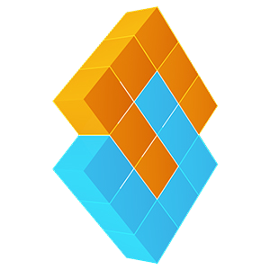

# Yolo v3 in Pytorch 1.3

## Who is Sugey

[Sugey](https://sugeyone.com) is a home based AI platform for disabilities like Alzheimer's and autism. We use unique camera systems and a private in-home server to help families and individuals live better lives.

We're approaching releasing our MVP, and if you're interested in helping, be sure to [contact us](https://sugeyone.com/contact).



## Another YOLOv3 clone? Why?

It takes anyone a few days at most to do computer vision with [PJReddie's YOLO](https://pjreddie.com/darknet/yolo/). You can plug it in, modify slightly, and go.

However, to really understand what's going on, and to be able to modify it for your own purposes, well, you should build it from scratch in your framework of choice.

So, we chose [Pytorch](https://pytorch.org/), that part was easy. The hard part was the breakdown. A big thanks to Ayoosh Kathuria, who did a [5 part series on Medium](https://blog.paperspace.com/how-to-implement-a-yolo-object-detector-in-pytorch/) walking through all of this code. We adjusted a few small things here or there, but the bulk of the code comes from his work.

However, Ayoosh assumed some knowledge, and we needed to understand every piece. So, we added commenting to nearly every line of code explaining what was going on, which in conjunction with the tutorial, should make this a unique repo for YOLOv3.

## Setups

You'll need tt download the weights.

```
wget https://pjreddie.com/media/files/yolov3.weights
```

We highly suggest using a virtual environment of your choice, and then (assuming you setup your environment with Python 3) installing the requirements file:

```
pip install requirements.txt
```

That should be enough to get you started.

## License

PJReddie put YOLO in the public domain. You can do whatever you
want with it as long as you assume "AS IS", that means, he (and we) are not reponsible for how you use it. We're throwing the MIT license on just because of all the commenting and educational work involved. You can do whatever you want with this software under that MIT license.

## Pull Requests

We definitely take pull requests!

Our request is that anything you do, you comment well. An example in the comments is helpful, but we don't want 3 paragraphs. Try a happy balance.

## Thank you

We definitely take pull requests!

Our request is that anything you do, you comment well. An example in the comments is helpful, but we don't want 3 paragraphs. Try a happy balance.
